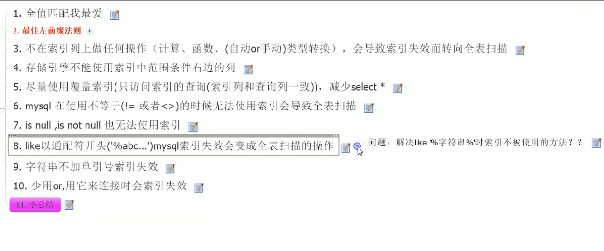

## 概述
是基于java的mysql的优化 而不是DBA
 - docker 创建Mysql容器
    docker run -d -p 3306:3306 -v /root/vol3/data:/var/lib/mysql -e MYSQL_ROOT_PASSWORD=123456 --name mysql mysql:5.5.48
 - docker 启动容器
   docker start 容器名
 - docker查看容器
   - docker ps
 - docker 查看创建的镜像
   - docker images
 - 服务器每次重启 要用Kill把已经运行的mysqld进程杀掉 才能执行 docker start mysql
## mysql linux的安装
rpm安装
 - 先安装 server
rpm -ivh MySQL-server-5.5.48-1.linux1.6.i386.rpm
 - 再安装 client
   rpm -ivh MySQL-server-5.5.48-1.linux1.6.i386.rpm
## mysql的架构介绍

## 素引优化分析

## 查询截取

## 主从复制

## mysql锁机制

rpm -ivh MySQL-client-5.5.48-1.el7.x86_64.rpm
rpm -ivh MySQL-devel-5.5.48-1.el7.x86_64.rpm
rpm -ivh MySQL-embedded-5.5.48-1.el7.x86_64.rpm
rpm -ivh MySQL-shared-5.5.48-1.el7.x86_64.rpm
rpm -ivh MySQL-shared-compat-5.5.48-1.el7.x86_64.rpm
rpm -ivh MySQL-test-5.5.48-1.el7.x86_64.rpm
rpm -ivh MySQL-server-5.5.48-1.el7.x86_64.rpm
————————————————
版权声明：本文为CSDN博主「南亭*.*」的原创文章，遵循CC 4.0 BY-SA版权协议，转载请附上原文出处链接及本声明。
原文链接：https://blog.csdn.net/weixin_44022426/article/details/125694223

## mysql的逻辑架构
- 第一层
  - controller层
    - 如JDBC .NET NATIVE C  等等 语言与数据库的交流工具
- 第二层
  - 链接层[连接池] 
    - 如 Thread Reuse Connction Limit Check Memory Caches Authentication
  - 工具层
    - 备份 恢复 回滚 复制 集群
  - Sql接口
    - DML DDL Trigger
  - Parser 过滤
    - Query Translation
  - Optimizer Mysql优化器
    - Access Path
  - Cache Buffers 缓存和缓冲
    - Global and Engine Specific Caches & Buffer
- 第三层
  - 可拔插的存储引擎
    - 如 innoDB MyiSAM NDB Archive ....
- 图解
  - 

# SQL慢的原因
 - 执行时间长
 - 查询时间长
   - 查询语句写的不好
   - 索引失败
   - 关联太多的join
   - 服务器调优的各个参数设置(缓冲 线程数等)
# 索引
- 为什么使用索引
- 比如一个表有 id name email age 属性 
- 这时候通过 select * from user where name =''; name属性可能会有很多不一样的值 所以会全表查询 就会很慢 所以要使用索引
  - 单值索引
  - 创建索引 潜规则名字 : idx_表_列 
    - create index idx_user_name on user(name)
      - 等于
      - create table user
      - 语法
      - create index 索引名 on 表(列)
  - 复合索引
    - select * from user where name ='' and email =""; 同时需要两个字段的查询
    - create index idx_user_name on user(name,email )

# SQL的查询流程
 - 手写
   - SELECT [属性] FROM [left_table] [JOIN_TYPE] JOIN [right_table] on [关联关系] WHERE [WHERE条件] GROUP BY [分组列] HAVING [HAVING LIST] ORDER BY [排序方法] LIMIT [查询结果条数]
 - 机读流程
   - 
# JOIN的七种方式
- 语法
select * from TableA A Left join Table B on A.id=B.id;
- 内连接 inner JOIN
  - 值 是表A 和 表B 共有的值 取交集
- 左连接 left join
  - 值 是左表A的值 并且包含和 右表B的交集
- 右连接 right join
  - 值 是右表B的值 并且包含和 左表A的交集
- 左链接 和 右链接的特殊模式[不包含和某一张表的交集 只筛选出表私有部分]
  - 
- 全连接 full outer join
  - 包含 表A 和 表B的值
    - mysql不支持全链接 解决方案 [union]
    - select * from t1 left join t2 
    - union
    - select * from t1 right join t2;
    - 
- 特殊的全连接
  - 
    - mysql不支持全链接 解决方案 [union]
    - select * from t1 left join t2 where t2.id =null
    - union
    - select * from t1 right join t2 where t1.id =null;

# 什么是索引
 index 是帮助Mysql高效获取的[数据结构]
 - 排好序的快速查找数据结构
 - 在数据之外 数据库系统还维护了满足特定查找算法的数据结构 这些数据结构 以某种方式指向数据
 - B结构 [二叉平衡树?]
 - 
 - 从上面的图中 可以看出 mysql会将索引放到一个二叉平衡树中 比如你的索引值为20 那么就会直接在二叉树中查询 然后就可以得到值的内存值 就不再需要全表查询

# 索引优势
类似大学图书馆建立索引 提高检索效率 降低数据库IO
通过索引对数据进行排序 降低数据排序的成本降低了CPU的消耗

# 索引的劣势
实际上索引也是一个表 该表保存了主键与索引字段 也会占内存空间
虽然索引提高了查询的时间 但是也会增加更新和添加的时间 因为不仅要添加数据 还要建立索引表
索引是一个提高性能的因素 如果你的mysql有大量的表 就需要花时间去研究最优的索引 或者优化查询

# 单值索引 
即一个索引只包含一个列 一个表可以有N个单值索引
 一张表索引最好不要超过5个
语法
CREATE [UNIQUE] INDEX indexName on TableName(ColumnName)
ALTER TableName ADD [UNIQUE] INDEX [indexName] on (ColumnName)
删除
DROP INDEX [IndexName] on tableName;

# 索引结构 和 搜索原理
BTREE索引 检索原理

# BTree的原理
首先BTree的原理也是一个树结构 并且是一个多路查找树
数据只会放在叶子节点
不会放在树节点上面

然后树节点上会有两个权值 和三个指针 p1 p2 p3 [并且三个指针的bT叫做三阶B+树]
假设该权值分别为 17 35
这时候需要查找一个18号值
就会去顶层树节点上比较 发现 17<18<35 所以会走 p2 小于17 就是p1 大于35 就是p3
然后直到走到改树的叶子节点 并且查找对应的值 如果有就返回 没有就返回null

# B+的新增操作
1.B+树插入都是在叶子结点进行的，就是插入前，需要先找到要插入的叶子结点。
2.如果被插入关键字的叶子节点，当前含有的关键字数量是小于阶数m，则直接插入。
3.如果插入关键字后，叶子节点当前含有的关键字数目等于阶数m，则插，该节点开始「分裂」为两个新的节点，一个节点包含⌊m/2⌋ 个关键字，另外一个关键字包含⌈m/2⌉个关键值。(⌊m/2⌋表示向下取整，⌈m/2⌉表示向上取整，如⌈3/2⌉=2)。
4.分裂后，需要将第⌈m/2⌉的关键字上移到父结点。如果这时候父结点中包含的关键字个数小于m，则插入操作完成。 [这里[m/2]计算的是要移动的元素的下标]
5.分裂后，需要将⌈m/2⌉的关键字上移到父结点。如果父结点中包含的关键字个数等于m，则继续分裂父结点。
# b+ 和 b-  树的区别

B+树和B-树的主要区别如下：
B-树内部节点是保存数据的;而B+树内部节点是不保存数据的，只作索引作用，它的叶子节点才保存数据。
B+树相邻的叶子节点之间是通过链表指针连起来的，B-树却不是。 [范围查找 会快的多]
查找过程中，B-树在找到具体的数值以后就结束，而B+树则需要通过索引找到叶子结点中的数据才结束
B-树中任何一个关键字出现且只出现在一个结点中，而B+树可以出现多次。

# 范围查询

# 面试题
为什么索引结构默认使用B+树，而不是B-Tree，Hash哈希，二叉树，红黑树?
简单版回答如下：
Hash哈希，只适合等值查询，不适合范围查询。
一般二叉树，可能会特殊化为一个链表，相当于全表扫描。
红黑树，是一种特化的平衡二叉树，MySQL 数据量很大的时候，索引的体积也会很大，内存放不下的而从磁盘读取，树的层次太高的话，读取磁盘的次数就多了。
B-Tree，叶子节点和非叶子节点都保存数据，相同的数据量，B+树更矮壮，也是就说，相同的数据量，B+树数据结构，查询磁盘的次数会更少。
# 查看一个表的索引
show index from [表名]
#  那些情况下适合索引
 - 主键默认就是一个索引 所以查询如果可以 最好就用主键查询
 - 频繁作为查询条件的字段 应该建立一个索引
 - 查询中与其他表关联的字段 外键关系建立索引 [on 后面的字段]
 - 频繁更新的字段不适合创建索引 因为每次更新不仅仅要更新表 而且还要更新一次索引表
 - Where条件中 用不到的字段不创建索引
 - 查询中排序的字段 排序字段若通过索引去访问将大大提高排序的速度

# 哪些情况下不适合索引
 - 表记录太少
 - 经常CRUD的表 [也是因为创建索引之后 更新表的内容 同时也会更新 索引表的内容]
 - 数据重复且分布均匀的表字段 因此应该职位最经常查询和最经常排序的数据列建立索引
 - 如果一个列包含许多重复的内容 为他建立索引就没有太大的效果

# 索引的性能指标 - 选择性
假如一个表 有一个字段A 只有T和F两种值 且每个值的分布各为50% 那么对于这种表 索引提高不到数据库速度 1000/2000 = 0.5 
索引的选择性指的是列中不同值的数量与表中记录的数量的比 如果一个表中有2000条记录 表索引有1980个不同的值 那么这个表的选择值就是 1980/2000=0.99
一个索引的选择性越接近1 那么这个效率就越高

# mysql性能分析
 - mysql query optimizer
   - 

# 性能分析 —— EXPLAIN
使用这个关键词 可以模拟优化你的SQL查询语句 从而知道mysql是如何处理你的SQL语句的 分析你的查询语句 或是表结构的性能瓶颈
 语法 
 Explain + SQL语句
 他会返回一张表给你
 表头 分别有 
 id select_type table type possible_keys key key_len ref rows Extra

# 子查询
https://www.php.cn/mysql-tutorials-461298.html#:~:text=%E5%9C%A8mysql%E4%B8%AD%EF%BC%8C%E5%AD%90%E6%9F%A5%E8%AF%A2%E6%98%AF%E6%8C%87%E5%B0%86%E4%B8%80%E4%B8%AA%E6%9F%A5%E8%AF%A2%E8%AF%AD%E5%8F%A5%E5%B5%8C%E5%A5%97%E5%9C%A8%E5%8F%A6%E4%B8%80%E4%B8%AA%E6%9F%A5%E8%AF%A2%E8%AF%AD%E5%8F%A5%E4%B8%AD%EF%BC%8C%E5%8F%AF%E4%BB%A5%E5%9C%A8SELECT%E3%80%81UPDATE%E5%92%8C%20DELETE%E8%AF%AD%E5%8F%A5%E4%B8%AD%E9%85%8D%E5%90%88WHERE%E5%AD%90%E5%8F%A5%E8%BF%9B%E8%A1%8C%E5%AE%9E%E7%8E%B0%EF%BC%8CWHERE%E5%AD%90%E5%8F%A5%E4%B8%AD%E8%AF%AD%E6%B3%95%E6%A0%BC%E5%BC%8F%E4%B8%BA%E2%80%9CWHERE,%3C%E8%A1%A8%E8%BE%BE%E5%BC%8F%3E%20%3C%E6%93%8D%E4%BD%9C%E7%AC%A6%3E%20%28%E5%8F%A6%E4%B8%80%E4%B8%AA%E6%9F%A5%E8%AF%A2%E8%AF%AD%E5%8F%A5%29%E2%80%9D%E3%80%82

#  内查询的查询顺序

# mysql 派生表
https://blog.csdn.net/luyaran/article/details/80925672

# select_type 查询的类型
SIMPLE PRIMARY SUBQUERY DERIVED UNION [UNION RESULT]
 - type的区别
   - SIMPLE
   - 简单的查询 没有子查询或者UNION
   - PRIMARY
   - 查询中若包含任何复杂的子部分 最外层的查询就是PRIMARY
   - SUBQUERY
   - 在SELECT 或者 WHERE 中 包含了子查询
   - DERIVED
   - 在查询中FROM的结构里放入了衍生表 就会将其标记为DERIVED
   - UNION  全连接
   - 第二个SELECT如果出现在UNION之后 则被标记为UNION 若UNION包含在FROM字句的子查询中 外层的select 被标记为DERIVED
   - UNION RESULT
   - 从全连接表获取值的SELECT
# table
显示这一行SELECT的数据 是关于那一张表的
# type
 访问类型排列
 显示查询使用了何种类型
 从好到坏的是
 system>const>eq_ref>ref>range>index>All

ALL 代表 全表扫描

System : 表只有一行记录 这是Const类型的特例 平时不会出现 这个也可以忽略不计

const : 表示通过索引一次就找到了 const 用于比较primary key 或者 unique索引 因为只匹配一行数据 所以很快
如将主键置于where表中 mysql 就能将给查询转换为一个常量 比如 [select * from t1 where t1.id=1;  这里就是主键直接索引]

eq_ref 唯一性索引扫描 对于每个索引键 表中只有一条数据与之匹配 常见在主键或者唯一索引扫描

ref 非唯一性索引扫描 返回匹配某个单独值的行
    本质也是一个索引访问 他返回所有匹配某个单独值的行 然而
    他可能会找到多个符合条件的行 所以他应该属于查找和扫描的混合体

range 只检索给定范围的行 使用一个索引来选择行 key显示使用了哪一个索引
      一般就是你的where语句中出现了 between < > in 等语语句 就会是range
      这种范围查找一般要比全局查找来的快 因为只用从一点到另一点 并不用全表扫描

index FullIndexScan index和All的区别就是 只遍历索引树 这通常比All快 因为INDEX文件 要比数据文件小
      虽然说ALL和Index都是读全表 但INDEX是从索引中读取的 而ALL是从硬盘中IO读取的

#  possible_keys 和 key
 possible_keys : 是否使用到了索引 
 key : 具体使用的索引

# 索引查询
比如你给 col1 col2 建立一个索引 
然后你查询的内容也刚好是col1 col2 select col1,col2 from xxx; 那么这时候type就是索引查找 因为可以直接去索引树里查找数据

# rows
根据表统计的信息 和索引引用 计算出有多少行被优化器查询
# Extra
包含不适合在其他列使用 但是很重要的信息
    - Using filesort 说明mysql会对数据使用一个外部的索引排序 而不是按照表内的索引顺序进行读取 这个最好被优化掉
        -   这张图片的前提代码 create index idx_col1_col2_col3 on tb1(col1,col2,col3);
        -   
    - Using temporary 使用了临时表保存中间结果 mysql在对查询结果排序时使用了临时表 常见于排序order by 和 group by
    - Using Index 表示使用了索引 避免访问了数据行 效率很高 如果同时出现 Using where 表示索引被用来查找 如果没有出现Using  where 表示索引用来读取数据 而非查找
        -   覆盖索引 [不要select * !!]
        -   

# 单表优化

 - 为什么索引丢失
 - 
要注意因为使用范围查找而导致的索引丢失问题 

# 多表优化
 - 主外键关联后 到底索引加在哪里呢
 - 左连接 索引加在右表 是ref 左表为 index  然后 ref>index 所以加在右表
 - 
 - 右链接 建在左表

# 三表
 - select * from a left join b on a.bid =b.id left join c on a.cid = c.id [一般A表在这种情况下是一个中间表]
 - 没有优化时的EXPLAIN结果
 -  
 - 可以发现三个表 全都是全表查询 效率很低
 - 首先通过左连接索引建在右表的机制来建立索引 可以发现type变成了ref Extra也变成了useIndex
 - 

# 多表的结论
尽可能的减少Join语句的循环次数 永远用小表来驱动大表
比如用 书籍分类 来驱动 书籍表
保证JOIN条件字段 建立了索引 [on 后面的值]

# 索引优化
 - 索引失效如何避免
   - 以下索引环境 ALTER table staffs add index idx_staff_nameAgePos(name,age,pos);
      - 十条规则 

      - **全值匹配**
        - EXPLAIN SELECT * FROM staffs where staffs.name = "July"
          - 查询type为ref    ref引用为const 
        - EXPLAIN SELECT * FROM staffs where staffs.name = "July" AND staffs.age =23;
          - 查询type为ref    ref引用为const,const 
        - EXPLAIN SELECT * FROM staffs where staffs.name = "July" AND staffs.age =23 and staffs.pos = "dev";
          - 查询type为ref    ref引用为const,const,const  
        - EXPLAIN SELECT * FROM staffs where  staffs.age =23 and staffs.pos = "dev"; 
          - 查询type为All    ref 引用变成了null  
        - EXPLAIN SELECT * FROM staffs where  staffs.pos = "dev";
          - 查询type为All    ref 引用变成了null  
        - [为什么不按照索引创建顺序查找 会产生索引丢失呢?]
          - 最佳左前缀法则 [查询时最左索引值 不能丢失 并且顺序不能乱(中间兄弟不能断) ]
            - ALTER table staffs add index idx_staff_nameAgePos(name,age,pos); 
            - 这条创建索引的语句的最左前缀就是name属性
            - example : 索引是一个火车 name 最左值就相当于是一个火车头 后面的属性就是车厢 火车头可以带N个车厢 但是车厢并不能单独行驶
            - EXPLAIN SELECT * FROM staffs where staffs.name = "July" AND staffs.pos ="dev";
              - 这条语句就是顺序不一样 结果type为ref ref应用只有一个const

      - **不要在索引列上做任何的操作(计算 函数 (自动or手动)类型转换) 会导致索引失效 转向全表查询**
        - 使用函数导致的索引丢失
        - EXPLAIN SELECT * FROM staffs where name = "July";
          - 查询type为ref    ref引用为const 
        - SELECT * FROM staffs where left(name,3)= "July"; [LEFT()函数是一个字符串函数，它返回具有指定长度的字符串的左边部分。 这里相当于查询name="Jul"的值 ]
          - 查询type为 ALL ref引用为Null 

      - **存储引擎不能使用索引中范围条件右边的列**
        - 范围查询导致的索引丢失  所以要避免范围 解决方案就是删除索引 只建立另外两个常量的索引 [ALTER table staffs add index idx_staff_namePos(name,pos);]
          - EXPLAIN SELECT * FROM staffs where staffs.name = "July" AND staffs.age > 2  and staffs.pos = "dev";
            - 这时type为range ref为null 
            - 通过ALTER table staffs add index idx_staff_namePos(name,pos); 之后
            - type变为了ref   ref引用为const,const  
          - EXPLAIN SELECT * FROM staffs where staffs.name = "July" AND staffs.age =23 and staffs.pos = "dev";
            - 这行代码虽然是全值匹配 但是不是覆盖索引 所以他的Extra只有useWhere
          - EXPLAIN SELECT name,age,pos FROM staffs where staffs.name = "July" AND staffs.age =23 and staffs.pos = "dev";
            - 使用了全值匹配 并且使用了覆盖查询 Extra值为 UseIndex 
          - 并且通过覆盖查询 可以让范围查询的type从range变为ref 但是范围查询后索引丢失问题 依然存在

        - **mysql在使用不等于 != 或者 <> 的时候 无法使用索引 而是全表扫描**
        - **is null , not null 也无法使用索引**
        
      - **like 以通配符开头(%abc, *)) 会导致索引失效 变为全表扫描**
        - EXPLAIN select * from staffs where NAME LIKE "%July%" ;
        - 这行语句的type 为All ref为null 
          - 尝试优化 改为覆盖索引
          - EXPLAIN select name,age,pos from staffs where NAME LIKE "%July%" ;
          - 这时 type为Index[index就是全索引数扫描] ref为null  
          - select 主键 也可以
        - EXPLAIN select * from staffs where NAME LIKE "July%" ;
        - 这行语句的type为range ref为null Extra为Using Index 
        -  [总结 like通配放右边]
        
        - 字符串不加单引号索引失效 varchar() 类型 必须加单引号
        - EXPLAIN SELECT * from staffs where name = '2000';
          - 加了单引号的时候 type为ref ref为const 
        - EXPLAIN SELECT * from staffs where name = 2000;
          - 没有单引号 type为All ref为null 这里是违背了 [避免mysql自动数据类型转换] 导致的索引失效
          - EXPLAIN SELECT name from staffs where name = 2000;
          - 如果改为覆盖索引 type为index
      
      - **少用or or也会导致索引失效**
# 小总结

# 索引面试题
索引环境 create index idx_c1234 on test03(c1,c2,c3,c4);

    -- show index from test03;
    -- -- 全值匹配
    -- EXPLAIN select * from test03 where c1 = "a1" and c2="a2" and c3="a3" and c4 ="a4";
    --
    -- -- 中间断开 打乱顺序 为什么可以自动优化使用到四个索引呢?
    -- -- 因为mysql有自动优化机制
    -- EXPLAIN select * from test03 where c1 = "a1"  and c4 ="a4" and c3="a3" and c2="a2" ;
    -- EXPLAIN select * from test03 where c4 = "a4"  and c3 ="a3" and c2="a2" and c1="a1" ;
    --
    -- -- 范围查询 c1 c2 c3 可以用 c4不能
    -- EXPLAIN select c1,c2,c3,c4 from test03 where c1="a1" and c2 ="a2" and c3>"a3" and c4 ="c4";
    -- -- 这里可以获得四个索引 因为mysql调优会自动排序索引 然后真实的语句是c4在c3之后
    -- EXPLAIN select * from test03 where c1="a1" and c2 ="a2" and c4>"a4" and c3 ="c3";
    -- -- 优化后  所以索引建立的时候 create index xxx on tbl(普通属性,....,可能会使用like的属性)
    -- EXPLAIN select * from test03 where c1="a1" and c2 ="a2"  and c3 ="c3" and c4>"a4";
    --
    -- -- order by 方法 索引有两大功能 查找和排序 C3在底层也使用到了索引 但是是用于排序 然后c4和c3的位置做了底层优化 所以没有断开
    -- EXPLAIN select * from test03 where c1="a1" and c2 ="a2" and c4 = "a4" ORDER BY c3;
    --
    -- EXPLAIN select * from test03 where c1="a1" and c2 ="a2"  ORDER BY c3;
    --
    -- -- order by 但是索引中间断开了 所以 Extra信息中有一个 Using FileSort 也就是排序没有使用索引 而是使用了文件排序
    -- EXPLAIN select * from test03 where c1="a1" and c2 ="a2"  ORDER BY c4;
    --
    -- 这里看起来是只用了c1的索引 但是c2 c3 也用了索引 因为优化编译 并且是用索引来排序
    EXPLAIN select * from test03 where c1="a1" and c5 ="a5"  ORDER BY c2,c3;
    -- 这样会出现using filesort  这里 3 2 索引位置错了
    EXPLAIN select * from test03 where c1="a1" and c5 ="a5"  ORDER BY c3,c2;
    --  为什么这里同样颠倒了索引顺序 但是依然没有filesort呢 因为在这里c2 已经是一个常量了 mysql会将其优化为 order by c3,常量值  
    EXPLAIN SELECT * from test03 where c1="a1" and c2 = "c2" ORDER BY c3,c2;
    -- 这里也是同理
    EXPLAIN SELECT * from test03 where c1="a1" and c3 = "c3" ORDER BY c3,c2;

- 总结
- 
- 

## like索引
因为是常量开头 所以也可以用到C  这里用到了a b c
where a =3 and b like "kk%" and c=4
因为是通配符开头 所以索引失效  这里用到了a
where a =3 and b like "%kk" and c=4
因为是通配符开头 所以索引失效  这里用到了a
where a =3 and b like "%kk%" and c=4
因为是常量开头 所以也可以用到C  这里用到了a b c
where a =3 and b like "k%kk%" and c=4

# 【优化总结口诀】
全值匹配我最爱，最左前缀要遵守[火车头]；
带头大哥不能死，中间兄弟不能断；
索引列上少计算，范围之后全失效[>]；
Like百分写最右[like kk%]，覆盖索引不写星；
不等空值还有or[!= ,is null ,not null,<>]，索引失效要少用；
VAR引号不可丢[""]，SQL高级也不难！ 

mysql 优化的步骤
  1 慢SQL的开启和捕获
  2 explain + 慢SQL分析
  3 show profile 查询SQL在Mysql 服务器里面的执行细节和生命周期情况
  4 SQL数据库服务器的参数调优

# 小表驱动大表
比如用五条记录的表 驱动 五千条记录的表 类似书的分类 和 书的信息
 - 伪代码 in的 时候
 - 
 - 使用 exists
 - 
 - 当B表的数据 必须小于A表数据集时 用in 优于exists 反之亦然
 - 注意 两个表的关联字段 必须建立索引
 - 
# EXISTS的语法
 SELECT ... FROM TABLE WHERE EXISTS(subquery)
 改语法可以理解为 将主查询的数据 放到子查询中做条件验证  根据验证结果 (True or false) 来决定主查询的数据结果是否得以保留
 - EXISTS(subQuery)中的子查询 select 字段 from 的字段值可以为任意的一个常量 如 
   - select 1 from  ;  也可以是 select x from 都可以 因为只是返回一个True false [官方解释的是 会忽略SELECT清单 因此没有区别]
   - EXISTS 的子查询实际运行时 也会进行优化 
   - 子查询往往也可以使用条件表达式 其他子查询 或者 JOIN来替代 最优的情况只有 具体情况 具体分析

# 何时使用EXISTS 和 IN 如何选择
如果从表小于主表 那么就可以使用 IN 因为IN的执行是 先查询从表 在将从表的值拿去和主表对比
如果主表小于从表 就使用 EXISTS 因为这个是先查询主表 然后将主表值 拿去和从表比较
 - 总结
   - 如果从表小就用IN 如果主表小 就用 EXISTS 因为要避免创建多次数据库连接

# 代码
 --  in 先查询 从表 然后将从表结果 比对 主表字段 所以如果从表小 就用in
 SELECT * from tbl_emp d where d.deptId in (select id from tbl_dept);

-- EXISTS 先查询主表 然后将结果于从表比对 如果主表小就用EXISTS
SELECT * from tbl_emp d where EXISTS (select 1 from tbl_dept where d.deptId = tbl_dept.id);
# sql锁
 - 表锁(偏读)
   - 数据库引擎要从 innoDB 改为 myisam
   - 手动添加表锁的代码
   - lock table 表名 read(write),表2 read(write),其他表...
     - 案例 给mylock 读锁 给 book 写锁  
     - lock table mylock read,book WRITE;
   - show open tables; 查看所有的锁
   - unlock table; 解锁
   - READ锁 [保证加锁的表 数据不会改变]
     - 首先先创建两个数据库连接 l1 l2
     - 然后 l1 创建了读锁在book表上
     - 这时 l1 可以读book表 但是不能增删改[直接报错] 而且也不能读取其他的表 [select * from othertable;]
     - 这时的l2 可以读book表 也不能增删改[阻塞 等待加锁的数据库连接执行 unlock tables; 释放锁] 但是可以读取其他的表
     - 图解 
     -  
   - write锁 [保证加锁的表 只能通过一个连接 读写]
     - 首先先创建两个数据库连接 l1 l2
     - 然后 l1 创建了写锁在book表上
     - 这时 l1 可以读取book表 也可以修改book表 但是不能读取其他表[报错]
     - 这时 l2 不能读取book表[阻塞]  也不能修改[阻塞]   可以读取其他表
   - 查看锁的详情
     - show status like "table%"
     - 他会返回两个参数
     - Table_locks_immediate 产生表锁定的次数 表示可以立即获取锁的查询次数 每立即获取锁 值加一
     - Table_locks_waited  出现表锁定争夺而发生等待的次数(不能立即获取次数 每等一次 值加一) 此值如果很高 说明有严重的表争用情况
   - myisam引擎
     - 
 - 两个引擎的区别有什么 innoDB 和 MyISAM
   - innoDB 支持事务(丢脏重幻)  开销大 加锁慢 会出现死锁; 锁的粒度小 发送锁冲突的几率低 并发度高
   - myISAM 支持行级锁
 - 复习 事务隔离级别
   - 未提交读 最低级别 只能保证不读取物理上损坏的数据 会产生脏读 不可重复读 欢度
   - 已提交读 语句级   可以避免脏读
   - 可重复读 事务级   可以避免脏读 不可重复读
   - 可序列化 最高级别 事务级 可以避免脏读 不可重复读 幻读
   - 
 - 复习 CAP理论
   - CAP是一个分布式系统的设计理论 叫做 C->数据一致性 A--> 可用性 P--> 分区容忍性
   - CAP如何选择? 
     - 我们上面已经知道了，在设计分布式系统时，架构师们在 C、A、P 这三种特性里，只能选择两种。
       但是，这道 CAP 的选择题，就像别人在问你“小明的父亲有三个孩子，老大叫大朗，老二叫二郎，请问老三叫什么”一样。在以分布式存系统为限定条件的 CAP 世界里，P 是早已经确定的答案，P 是必须的。
       因为，在分布式系统内，P 是必然的发生的，不选 P，一旦发生分区错误，整个分布式系统就完全无法使用了，这是不符合实际需要的。所以，对于分布式系统，我们只能能考虑当发生分区错误时，如何选择一致性和可用性。
       而根据一致性和可用性的选择不同，开源的分布式系统往往又被分为 CP 系统和 AP 系统。
       当一套系统在发生分区故障后，客户端的任何请求都被卡死或者超时，但是，系统的每个节点总是会返回一致的数据，则这套系统就是 CP 系统，经典的比如 Zookeeper。
       如果一套系统发生分区故障后，客户端依然可以访问系统，但是获取的数据有的是新的数据，有的还是老数据，那么这套系统就是 AP 系统，经典的比如 Eureka。
       说了这么多，其实 CAP 定理本质很简单，它就是一种分布式系统设计的不同理念概括，包括它说的一致性，可用性和分区容错性。这就类似一个大学的校训，是极度概念化的东西。
       所以，大白话来形容下 CAP 吧，CAP 就是告诉程序员们当分布式系统出现内部问题了，你要做两种选择：
       要么迁就外部服务，像外包公司。
       要么让外部服务迁就你，像银行。
       迁就外部服务就是我们不能因为我们自己的问题让外部服务的业务运行受到影响，所以要优先可用性。而让外部服务迁就我们，就要优先一致性。
 - 行锁(偏写)
   - set autocommit = 0 ; 关闭自动提交事务
   - 这时在l1 中update数据库 然后l1可以查询到更新后的值 但是 l2 不能查询到 说明没有出现脏读现象 如果l1 l2执行了commit后 就可以读取了
   - 如果l1 l2 同时update 先执行的可以更新到自己数据中 这时没有commit l2 也无法读取 然后这时 l2 也执行update 会被l1 的行锁阻塞 这时 l1 执行commit l2 就会取消阻塞
   - myISAM引擎 会出现脏读
   - 行锁只会对一行数据加锁
   - 如果两个数据库连接 分别操作不同行的数据 比如 l1 操作 id = 1 然后 l2 操作 id =2 是不会产生阻塞的 所以效率比较高 类似于java的乐观锁[轻量级锁]
     - 行锁失效 升级为表锁 
     - 如果 l1 or l2 操作表时 导致了索引失效的操作 例如 使用了自动数据转换 就会锁升级 变为表锁[悲观锁 重量级锁]
   
 - 间隙锁的危害
   - 间隙锁就是 使用行锁时 修改了多行的数据[一个范围查询] 比如 where a >1 and a<6 ;这时即使表中的a列没有 2 3 4 5 值 mysql也会将这几行数据加锁 称为间隙锁[GAP LOCK]
   - 造成的问题就是 比如table中 a 列 有 3 4 5 值 l1 通过范围查找 a>1 and a<6 的值并且修改 但是这时l2 插入一条数据 a为2 看起来不会冲突 但是因为间隙锁 所以还是会阻塞等待
   - 
   - 好处 
   - 可以解决幻读
 - 行锁的问题 如何锁定一行?
  [ - begin;
   - select * from table where a =8 [for update]; //这时 a=8 的行 就被锁定了 直到这个事务被commit
   - commit;
   - for update 的作用 : 悲观锁 就是假设这一行一定会起冲突 类似于synchroni]()zed
 - 行锁总结
   - 
 - 页锁

# 主从复制

# mysql查询
 - 一些特殊查询
   - 去除重复行
     - SELECT [DISTINCT] id from table;
       - DISTINCT 去重
   - 空值参与运算
     - 首先 null!=0 && null!='' 
       - 如果一个列为null 当他参与运算的时候 结果会变为null
       - 可以通过 [IFNULL()函数] 例如 IFNULL[id,0]; // 如果id为null 则会被当作0处理
   - 着重号 ``
     - 该符号用于区分表名和MYSQL关键字 例如一个表叫做ORDER 该字段与mysql的排序关键字重复 所以要用 
       - SELECT * from `ORDER`
   - 查询常数
     - 通过常数 可以生成一列固定value的结果集
       - SELECT 0,'test',id ,name from table;
       - 上面的 0 和 'test'都是常数
       - 然后就会在结果集中生成 列名为 0 test 值为 0 test 的两个列
       - 
   - 显示表结构
     - DESCRIBE TABLE;
       - DESC TABLE;
 - 过滤
   - where 关键字
   - where中不能使用别名 因为mysql执行 语句顺序为 FROM --> WHERE ---> SELECT[这里才有别名]--->ORDER BY
# in函数
SELECT * from t where id  in(1,2,3) ; [同时查询 id为 1 2 3 的数据 从t 表中]
# 排序 分页
 - 排序
   - ORDER BY 
     - 如果没有使用排序操作 默认就是表里面的数据先后顺序
     - 按照salary从高到低显示员工信息 
       - select employee_info from table [ORDER BY] salary;[默认为升序]
     - 升序[ASC 默认] 降序[DESC]
       - select employee_info from table [ORDER BY] salary [DESC];
     - 按照salary降序 并且按照id升序
       - select employee_info from table [ORDER BY] salary [DESC],id [ASC];
 - 分页
   - 通过limit来限制页容量
     - select id from employee LIMIT 0,20;[从0开始偏移到20 会返回20条数据 0-->19的记录 ]
     - select id from employee LIMIT 15,20;[从15开始偏移20个记录 会返回20条数据 返回的是 15-->34的记录]
     - select id from employee LIMIT 40,20;[从40开始偏移20个记录 会返回20条数据 返回的是 40-->59的记录]
   - LIMIT的位置 必须在最后
     - select id from table [WHERE] id =1 [ORDER BY] id [LIMIT] 0,10;
   - 获取第一个数据
     - select id from table [WHERE] id =1 [ORDER BY] id [LIMIT] 1;
     - limit 1 就是limit 0,1;的缩写

# rownum
这是一个隐藏的列 返回的是该数据在mysql的行号
select rownum from table ORDER BY rownum ASC ; //按照行号升序

# 多表查询
 LEFT JOIN , RIGHT JOIN
 通过左连接 和 右链接 来做一个关联 
 - 为什么要使用多表查询?
   - 多表查询 也就是一个表中 包含了另一个表的PRIMARY KEY 并且通过该KEY 与隔壁表形成关联 并且查询
 - 类似
   - t1 的字段中 含有 t2.id 并且字段名叫做 t1.t2_id;
   - 那么就可以 通过 select * from t1 [LEFT JOIN] t2 on t1.t2_id = t2.id;  通过t1中的t2id 来查询 t1 和 t2 有关联的信息
# 非等值连接

# 连接表事项

# 函数
- IF
IF(x>6000,"high",'low'); // 相当于三元 x>6000?'high':'low'
还可以配合 IS NOT NULL
IF(x IS NOT NULL,'not null','null')

- IFNULL
  - IFNULL(data,0); // 如果data为null 就返回0
  - 
- CASE WHEN....THEN  ELSE  [相当于java的if else]            [END为该列的列名 ]
  - select * from table CASE WHEN table.id>10 THEN 'more than 10'
  -                          WHEN table.id>20 THEN 'more than 20'
  -                          ELSE 'other' END 'title'
  - java
  - if(table.id>10) {more than 10}
  - else if(table.id>20 ){more than 20};
- CASE data WHEN THEN ELSE [CASE 后面加一个参数][相当于java的 switch case]
    - select * from table CASE table.id WHEN 10 THEN 'more than 10'
    -                                   WHEN 20 THEN 'more than 20'
    -                                   ELSE 'other' END 'title'
    - java
    - switch(table.id){
    - case 10: more than 10;
    - case 20: more than 20;
    - ...
    - }
- CURDDATE() NOW()
  - 返回当前时间
- str_to_date()
  - 字符串转为日期str_to_date('1997-01-01','%Y-%M-%D');
- date_format()
  - 日期转为字符串date_format(date,'%Y-%M-%D')
- DateDiff(d1,d2)
  - 返回d1-d2的日期间隔
- TRUNCATE()
  - 保留小数点几位
  - TRUNCATE(4800.00,0);//保留0位 变为 4800
- concat() 字符串拼接
  - select concat(id,',',name) 'id_name' from table where id =1;
  - 
- 查询id为10 20 30的
  - select * from table where id in (10,20,30)

- 查询一个员工 并且将她的id name 作为一个列输出
- select concat(id,',',name) 'id_name' from table where id =1; 

# 聚合函数
 - 常见的几个聚合函数
   - AVG/SUM [只能是数值]
     - SELECT AVG(salary),SUM(salary) from table;//输出salary的平均值和总和
   - MAX/MIN [日期时间 字符串 数字 都可以排序]
     - SELECT MAX(salary),MIN(salary) from table;//输出salary的最大值和最小值
   - COUNT [计数 ]
     - 
     - 通过字段计算出现的次数 不一定==数据的个数
       - select COUNT(id) from table;
       - 上面的其实等于
       - select COUNT(id) from table where id is not null;
       - 因为count不会统计null字段
   - 通过count解决平均值的问题
     - 问题 计算salary的平均值
       - 通过AVG
       - select AVG(salary) from table;
       - 通过count
       - select SUM(salary)/count(salary) from table;
       - AVG的问题 如果一条记录的salary为空 但是他还是会将该值作为除数 比如 107个人 里面有一个人没有工作 但是他还是会用 SUM(salary)/107 而不是106
       - 通过count不会记录null 就可以解决这个问题 
       - 还可以 select AVG(IFNULL(salary,0)) from table;
 - GROUP BY的使用
   - 分组
     - 查询各个部门的平均工资
     - select AVG(IFNULL(salary,0)) from table [group by] department_id // 通过department_id 来分组
     - select AVG(IFNULL(salary,0)) from table [group by] department_id,job_id // 通过department_id  和 job_id来分组
     - **出现在select中的字段 必须声明在group by中**
   - 新特性
     - WITH ROLLUP
     - select id,AVG(salary) from table group by id [with rollup];
     - 通过这个关键词 可以对结果集进行求平均值运算 并放在结果的最后一行
 - HAVING的使用
   - 
 - SQL的执行原理
   - 