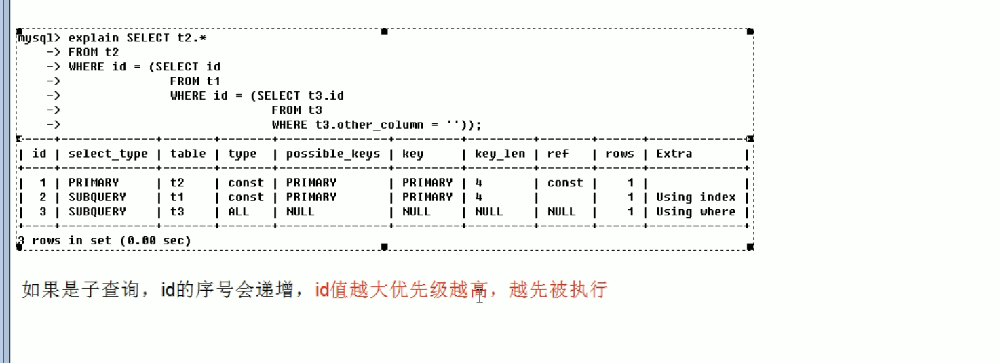
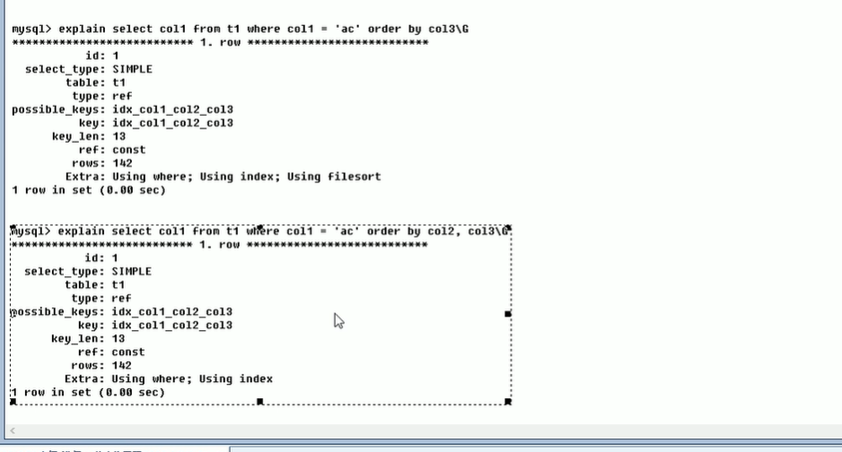

## 概述
是基于java的mysql的优化 而不是DBA
 - docker 创建Mysql容器
    docker run -d -p 3306:3306 -v /root/vol3/data:/var/lib/mysql -e MYSQL_ROOT_PASSWORD=123456 --name mysql mysql:5.5.48
 - docker 启动容器
   docker start 容器名
 - docker查看容器
   - docker ps
 - docker 查看创建的镜像
   - docker images
 - 服务器每次重启 要用Kill把已经运行的mysqld进程杀掉 才能执行 docker start mysql
## mysql linux的安装
rpm安装
 - 先安装 server
rpm -ivh MySQL-server-5.5.48-1.linux1.6.i386.rpm
 - 再安装 client
   rpm -ivh MySQL-server-5.5.48-1.linux1.6.i386.rpm
## mysql的架构介绍

## 素引优化分析

## 查询截取

## 主从复制

## mysql锁机制

rpm -ivh MySQL-client-5.5.48-1.el7.x86_64.rpm
rpm -ivh MySQL-devel-5.5.48-1.el7.x86_64.rpm
rpm -ivh MySQL-embedded-5.5.48-1.el7.x86_64.rpm
rpm -ivh MySQL-shared-5.5.48-1.el7.x86_64.rpm
rpm -ivh MySQL-shared-compat-5.5.48-1.el7.x86_64.rpm
rpm -ivh MySQL-test-5.5.48-1.el7.x86_64.rpm
rpm -ivh MySQL-server-5.5.48-1.el7.x86_64.rpm
————————————————
版权声明：本文为CSDN博主「南亭*.*」的原创文章，遵循CC 4.0 BY-SA版权协议，转载请附上原文出处链接及本声明。
原文链接：https://blog.csdn.net/weixin_44022426/article/details/125694223

## mysql的逻辑架构
- 第一层
  - controller层
    - 如JDBC .NET NATIVE C  等等 语言与数据库的交流工具
- 第二层
  - 链接层[连接池] 
    - 如 Thread Reuse Connction Limit Check Memory Caches Authentication
  - 工具层
    - 备份 恢复 回滚 复制 集群
  - Sql接口
    - DML DDL Trigger
  - Parser 过滤
    - Query Translation
  - Optimizer Mysql优化器
    - Access Path
  - Cache Buffers 缓存和缓冲
    - Global and Engine Specific Caches & Buffer
- 第三层
  - 可拔插的存储引擎
    - 如 innoDB MyiSAM NDB Archive ....
- 图解
  - 

# SQL慢的原因
 - 执行时间长
 - 查询时间长
   - 查询语句写的不好
   - 索引失败
   - 关联太多的join
   - 服务器调优的各个参数设置(缓冲 线程数等)
# 索引
- 为什么使用索引
- 比如一个表有 id name email age 属性 
- 这时候通过 select * from user where name =''; name属性可能会有很多不一样的值 所以会全表查询 就会很慢 所以要使用索引
  - 单值索引
  - 创建索引 潜规则名字 : idx_表_列 
    - create index idx_user_name on user(name)
      - 等于
      - create table user
      - 语法
      - create index 索引名 on 表(列)
  - 复合索引
    - select * from user where name ='' and email =""; 同时需要两个字段的查询
    - create index idx_user_name on user(name,email )

# SQL的查询流程
 - 手写
   - SELECT [属性] FROM [left_table] [JOIN_TYPE] JOIN [right_table] on [关联关系] WHERE [WHERE条件] GROUP BY [分组列] HAVING [HAVING LIST] ORDER BY [排序方法] LIMIT [查询结果条数]
 - 机读流程
   - 
# JOIN的七种方式
- 语法
select * from TableA A Left join Table B on A.id=B.id;
- 内连接 inner JOIN
  - 值 是表A 和 表B 共有的值 取交集
- 左连接 left join
  - 值 是左表A的值 并且包含和 右表B的交集
- 右连接 right join
  - 值 是右表B的值 并且包含和 左表A的交集
- 左链接 和 右链接的特殊模式[不包含和某一张表的交集 只筛选出表私有部分]
  - 
- 全连接 full outer join
  - 包含 表A 和 表B的值
    - mysql不支持全链接 解决方案 [union]
    - select * from t1 left join t2 
    - union
    - select * from t1 right join t2;
    - 
- 特殊的全连接
  - 
    - mysql不支持全链接 解决方案 [union]
    - select * from t1 left join t2 where t2.id =null
    - union
    - select * from t1 right join t2 where t1.id =null;

# 什么是索引
 index 是帮助Mysql高效获取的[数据结构]
 - 排好序的快速查找数据结构
 - 在数据之外 数据库系统还维护了满足特定查找算法的数据结构 这些数据结构 以某种方式指向数据
 - B结构 [二叉平衡树?]
 - 
 - 从上面的图中 可以看出 mysql会将索引放到一个二叉平衡树中 比如你的索引值为20 那么就会直接在二叉树中查询 然后就可以得到值的内存值 就不再需要全表查询

# 索引优势
类似大学图书馆建立索引 提高检索效率 降低数据库IO
通过索引对数据进行排序 降低数据排序的成本降低了CPU的消耗

# 索引的劣势
实际上索引也是一个表 该表保存了主键与索引字段 也会占内存空间
虽然索引提高了查询的时间 但是也会增加更新和添加的时间 因为不仅要添加数据 还要建立索引表
索引是一个提高性能的因素 如果你的mysql有大量的表 就需要花时间去研究最优的索引 或者优化查询

# 单值索引 
即一个索引只包含一个列 一个表可以有N个单值索引
 一张表索引最好不要超过5个
语法
CREATE [UNIQUE] INDEX indexName on TableName(ColumnName)
ALTER TableName ADD [UNIQUE] INDEX [indexName] on (ColumnName)
删除
DROP INDEX [IndexName] on tableName;

# 索引结构 和 搜索原理
BTREE索引 检索原理

# BTree的原理
首先BTree的原理也是一个树结构 并且是一个多路查找树
数据只会放在叶子节点
不会放在树节点上面

然后树节点上会有两个权值 和三个指针 p1 p2 p3 [并且三个指针的bT叫做三阶B+树]
假设该权值分别为 17 35
这时候需要查找一个18号值
就会去顶层树节点上比较 发现 17<18<35 所以会走 p2 小于17 就是p1 大于35 就是p3
然后直到走到改树的叶子节点 并且查找对应的值 如果有就返回 没有就返回null

# B+的新增操作
1.B+树插入都是在叶子结点进行的，就是插入前，需要先找到要插入的叶子结点。
2.如果被插入关键字的叶子节点，当前含有的关键字数量是小于阶数m，则直接插入。
3.如果插入关键字后，叶子节点当前含有的关键字数目等于阶数m，则插，该节点开始「分裂」为两个新的节点，一个节点包含⌊m/2⌋ 个关键字，另外一个关键字包含⌈m/2⌉个关键值。(⌊m/2⌋表示向下取整，⌈m/2⌉表示向上取整，如⌈3/2⌉=2)。
4.分裂后，需要将第⌈m/2⌉的关键字上移到父结点。如果这时候父结点中包含的关键字个数小于m，则插入操作完成。 [这里[m/2]计算的是要移动的元素的下标]
5.分裂后，需要将⌈m/2⌉的关键字上移到父结点。如果父结点中包含的关键字个数等于m，则继续分裂父结点。
# b+ 和 b-  树的区别

B+树和B-树的主要区别如下：
B-树内部节点是保存数据的;而B+树内部节点是不保存数据的，只作索引作用，它的叶子节点才保存数据。
B+树相邻的叶子节点之间是通过链表指针连起来的，B-树却不是。 [范围查找 会快的多]
查找过程中，B-树在找到具体的数值以后就结束，而B+树则需要通过索引找到叶子结点中的数据才结束
B-树中任何一个关键字出现且只出现在一个结点中，而B+树可以出现多次。

# 范围查询

# 面试题
为什么索引结构默认使用B+树，而不是B-Tree，Hash哈希，二叉树，红黑树?
简单版回答如下：
Hash哈希，只适合等值查询，不适合范围查询。
一般二叉树，可能会特殊化为一个链表，相当于全表扫描。
红黑树，是一种特化的平衡二叉树，MySQL 数据量很大的时候，索引的体积也会很大，内存放不下的而从磁盘读取，树的层次太高的话，读取磁盘的次数就多了。
B-Tree，叶子节点和非叶子节点都保存数据，相同的数据量，B+树更矮壮，也是就说，相同的数据量，B+树数据结构，查询磁盘的次数会更少。
# 查看一个表的索引
show index from [表名]
#  那些情况下适合索引
 - 主键默认就是一个索引 所以查询如果可以 最好就用主键查询
 - 频繁作为查询条件的字段 应该建立一个索引
 - 查询中与其他表关联的字段 外键关系建立索引 [on 后面的字段]
 - 频繁更新的字段不适合创建索引 因为每次更新不仅仅要更新表 而且还要更新一次索引表
 - Where条件中 用不到的字段不创建索引
 - 查询中排序的字段 排序字段若通过索引去访问将大大提高排序的速度

# 哪些情况下不适合索引
 - 表记录太少
 - 经常CRUD的表 [也是因为创建索引之后 更新表的内容 同时也会更新 索引表的内容]
 - 数据重复且分布均匀的表字段 因此应该职位最经常查询和最经常排序的数据列建立索引
 - 如果一个列包含许多重复的内容 为他建立索引就没有太大的效果

# 索引的性能指标 - 选择性
假如一个表 有一个字段A 只有T和F两种值 且每个值的分布各为50% 那么对于这种表 索引提高不到数据库速度 1000/2000 = 0.5 
索引的选择性指的是列中不同值的数量与表中记录的数量的比 如果一个表中有2000条记录 表索引有1980个不同的值 那么这个表的选择值就是 1980/2000=0.99
一个索引的选择性越接近1 那么这个效率就越高

# mysql性能分析
 - mysql query optimizer
   - 

# 性能分析 —— EXPLAIN
使用这个关键词 可以模拟优化你的SQL查询语句 从而知道mysql是如何处理你的SQL语句的 分析你的查询语句 或是表结构的性能瓶颈
 语法 
 Explain + SQL语句
 他会返回一张表给你
 表头 分别有 
 id select_type table type possible_keys key key_len ref rows Extra

# 子查询
https://www.php.cn/mysql-tutorials-461298.html#:~:text=%E5%9C%A8mysql%E4%B8%AD%EF%BC%8C%E5%AD%90%E6%9F%A5%E8%AF%A2%E6%98%AF%E6%8C%87%E5%B0%86%E4%B8%80%E4%B8%AA%E6%9F%A5%E8%AF%A2%E8%AF%AD%E5%8F%A5%E5%B5%8C%E5%A5%97%E5%9C%A8%E5%8F%A6%E4%B8%80%E4%B8%AA%E6%9F%A5%E8%AF%A2%E8%AF%AD%E5%8F%A5%E4%B8%AD%EF%BC%8C%E5%8F%AF%E4%BB%A5%E5%9C%A8SELECT%E3%80%81UPDATE%E5%92%8C%20DELETE%E8%AF%AD%E5%8F%A5%E4%B8%AD%E9%85%8D%E5%90%88WHERE%E5%AD%90%E5%8F%A5%E8%BF%9B%E8%A1%8C%E5%AE%9E%E7%8E%B0%EF%BC%8CWHERE%E5%AD%90%E5%8F%A5%E4%B8%AD%E8%AF%AD%E6%B3%95%E6%A0%BC%E5%BC%8F%E4%B8%BA%E2%80%9CWHERE,%3C%E8%A1%A8%E8%BE%BE%E5%BC%8F%3E%20%3C%E6%93%8D%E4%BD%9C%E7%AC%A6%3E%20%28%E5%8F%A6%E4%B8%80%E4%B8%AA%E6%9F%A5%E8%AF%A2%E8%AF%AD%E5%8F%A5%29%E2%80%9D%E3%80%82

#  内查询的查询顺序

# mysql 派生表
https://blog.csdn.net/luyaran/article/details/80925672

# select_type 查询的类型
SIMPLE PRIMARY SUBQUERY DERIVED UNION [UNION RESULT]
 - type的区别
   - SIMPLE
   - 简单的查询 没有子查询或者UNION
   - PRIMARY
   - 查询中若包含任何复杂的子部分 最外层的查询就是PRIMARY
   - SUBQUERY
   - 在SELECT 或者 WHERE 中 包含了子查询
   - DERIVED
   - 在查询中FROM的结构里放入了衍生表 就会将其标记为DERIVED
   - UNION  全连接
   - 第二个SELECT如果出现在UNION之后 则被标记为UNION 若UNION包含在FROM字句的子查询中 外层的select 被标记为DERIVED
   - UNION RESULT
   - 从全连接表获取值的SELECT
# table
显示这一行SELECT的数据 是关于那一张表的
# type
 访问类型排列
 显示查询使用了何种类型
 从好到坏的是
 system>const>eq_ref>ref>range>index>All

ALL 代表 全表扫描

System : 表只有一行记录 这是Const类型的特例 平时不会出现 这个也可以忽略不计

const : 表示通过索引一次就找到了 const 用于比较primary key 或者 unique索引 因为只匹配一行数据 所以很快
如将主键置于where表中 mysql 就能将给查询转换为一个常量 比如 [select * from t1 where t1.id=1;  这里就是主键直接索引]

eq_ref 唯一性索引扫描 对于每个索引键 表中只有一条数据与之匹配 常见在主键或者唯一索引扫描

ref 非唯一性索引扫描 返回匹配某个单独值的行
    本质也是一个索引访问 他返回所有匹配某个单独值的行 然而
    他可能会找到多个符合条件的行 所以他应该属于查找和扫描的混合体

range 只检索给定范围的行 使用一个索引来选择行 key显示使用了哪一个索引
      一般就是你的where语句中出现了 between < > in 等语语句 就会是range
      这种范围查找一般要比全局查找来的快 因为只用从一点到另一点 并不用全表扫描

index FullIndexScan index和All的区别就是 只遍历索引树 这通常比All快 因为INDEX文件 要比数据文件小
      虽然说ALL和Index都是读全表 但INDEX是从索引中读取的 而ALL是从硬盘中IO读取的

#  possible_keys 和 key
 possible_keys : 是否使用到了索引 
 key : 具体使用的索引

# 索引查询
比如你给 col1 col2 建立一个索引 
然后你查询的内容也刚好是col1 col2 select col1,col2 from xxx; 那么这时候type就是索引查找 因为可以直接去索引树里查找数据

# rows
根据表统计的信息 和索引引用 计算出有多少行被优化器查询
# Extra
包含不适合在其他列使用 但是很重要的信息
    - Using filesort 说明mysql会对数据使用一个外部的索引排序 而不是按照表内的索引顺序进行读取 这个最好被优化掉
        -   这张图片的前提代码 create index idx_col1_col2_col3 on tb1(col1,col2,col3);
        -   
    - Using temporary 使用了临时表保存中间结果 mysql在对查询结果排序时使用了临时表 常见于排序order by 和 group by
    - Using Index 表示使用了索引 避免访问了数据行 效率很高 如果同时出现 Using where 表示索引被用来查找 如果没有出现Using  where 表示索引用来读取数据 而非查找
        -   覆盖索引 [不要select * !!]
        -   

# 单表优化

 - 为什么索引丢失
 - 
要注意因为使用范围查找而导致的索引丢失问题 

# 多表优化
 - 主外键关联后 到底索引加在哪里呢
 - 左连接 索引加在右表 是ref 左表为 index  然后 ref>index 所以加在右表
 - 
 - 右链接 建在左表

# 三表
 - select * from a left join b on a.bid =b.id left join c on a.cid = c.id [一般A表在这种情况下是一个中间表]
 - 没有优化时的EXPLAIN结果
 -  
 - 可以发现三个表 全都是全表查询 效率很低
 - 首先通过左连接索引建在右表的机制来建立索引 可以发现type变成了ref Extra也变成了useIndex
 - 

# 多表的结论
尽可能的减少Join语句的循环次数 永远用小表来驱动大表
比如用 书籍分类 来驱动 书籍表
保证JOIN条件字段 建立了索引 [on 后面的值]

# 索引优化
 - 索引失效如何避免
   - 以下索引环境 ALTER table staffs add index idx_staff_nameAgePos(name,age,pos);
      - 十条规则 

      - **全值匹配**
        - EXPLAIN SELECT * FROM staffs where staffs.name = "July"
          - 查询type为ref    ref引用为const 
        - EXPLAIN SELECT * FROM staffs where staffs.name = "July" AND staffs.age =23;
          - 查询type为ref    ref引用为const,const 
        - EXPLAIN SELECT * FROM staffs where staffs.name = "July" AND staffs.age =23 and staffs.pos = "dev";
          - 查询type为ref    ref引用为const,const,const  
        - EXPLAIN SELECT * FROM staffs where  staffs.age =23 and staffs.pos = "dev"; 
          - 查询type为All    ref 引用变成了null  
        - EXPLAIN SELECT * FROM staffs where  staffs.pos = "dev";
          - 查询type为All    ref 引用变成了null  
        - [为什么不按照索引创建顺序查找 会产生索引丢失呢?]
          - 最佳左前缀法则 [查询时最左索引值 不能丢失 并且顺序不能乱(中间兄弟不能断) ]
            - ALTER table staffs add index idx_staff_nameAgePos(name,age,pos); 
            - 这条创建索引的语句的最左前缀就是name属性
            - example : 索引是一个火车 name 最左值就相当于是一个火车头 后面的属性就是车厢 火车头可以带N个车厢 但是车厢并不能单独行驶
            - EXPLAIN SELECT * FROM staffs where staffs.name = "July" AND staffs.pos ="dev";
              - 这条语句就是顺序不一样 结果type为ref ref应用只有一个const

      - **不要在索引列上做任何的操作(计算 函数 (自动or手动)类型转换) 会导致索引失效 转向全表查询**
        - 使用函数导致的索引丢失
        - EXPLAIN SELECT * FROM staffs where name = "July";
          - 查询type为ref    ref引用为const 
        - SELECT * FROM staffs where left(name,3)= "July"; [LEFT()函数是一个字符串函数，它返回具有指定长度的字符串的左边部分。 这里相当于查询name="Jul"的值 ]
          - 查询type为 ALL ref引用为Null 

      - **存储引擎不能使用索引中范围条件右边的列**
        - 范围查询导致的索引丢失  所以要避免范围 解决方案就是删除索引 只建立另外两个常量的索引 [ALTER table staffs add index idx_staff_namePos(name,pos);]
          - EXPLAIN SELECT * FROM staffs where staffs.name = "July" AND staffs.age > 2  and staffs.pos = "dev";
            - 这时type为range ref为null 
            - 通过ALTER table staffs add index idx_staff_namePos(name,pos); 之后
            - type变为了ref   ref引用为const,const  
          - EXPLAIN SELECT * FROM staffs where staffs.name = "July" AND staffs.age =23 and staffs.pos = "dev";
            - 这行代码虽然是全值匹配 但是不是覆盖索引 所以他的Extra只有useWhere
          - EXPLAIN SELECT name,age,pos FROM staffs where staffs.name = "July" AND staffs.age =23 and staffs.pos = "dev";
            - 使用了全值匹配 并且使用了覆盖查询 Extra值为 UseIndex 
          - 并且通过覆盖查询 可以让范围查询的type从range变为ref 但是范围查询后索引丢失问题 依然存在
          - 